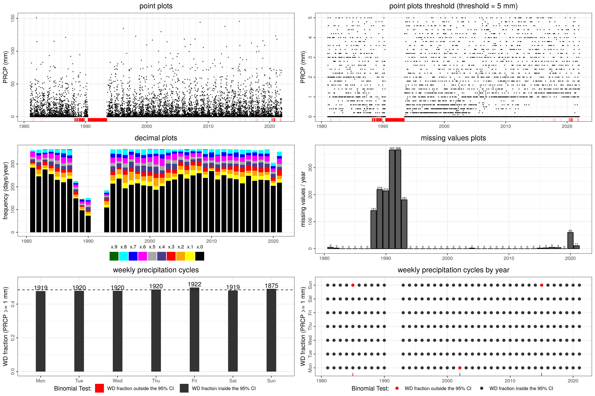

# enhanced_qc (enhanced quality control)

## Context

The Visual Quality Control for Detecting Systematic Errors was created in the project DECADE (Data on cl imate and Extreme weather for the Central AnDEs), financed by the program r4d (Swiss Programme for Research on Global Issues for Development). 

In a first step, the quality control (QC) tests and visualisations are suitable tools for data exploration. In a second step, systematic data quality problems that are not detected by most other QC methods can be identified and classified. The QC method was developed for daily maximum and minimum temperature (TX and TN, respectively) and precipitation (PRCP), but it is applicable to sub-daily temperature and precipitation observations as well.
The QC approach runs on R, and is therefore widely applicable (originally developed by Stefan Hunziker and is available [here](https://github.com/ybrugnara/DECADE_QC)). 

In this repo I remake the code in R and python (available soon), so it will be more widely applicable.

## Example

Using a sample time serie (/test/enhanced_qc_application.R) it can be possible to make the following plots. For a better understanding of these, you may read the original manual [here](https://github.com/ybrugnara/DECADE_QC/blob/master/Manual.docx).

  

## References

- Hunziker, S., Gubler, S., Calle, J., Moreno, I., Andrade, M., Velarde, F., Ticona, L., Carrasco, G., Castellón, Y., Oria, C., Croci-Maspoli, M., Konzelmann, T., Rohrer, M., and Brönnimann, S.: Identifying, attributing, and overcoming common data quality issues of manned station observations, International Journal of Climatology, 37, 4131-4145, 2017. https://doi.org/10.1002/joc.5037

- Hunziker, S., Brönnimann, S., Calle, J., Moreno, I., Andrade, M., Ticona, L., Huerta, A., and Lavado-Casimiro, W. (2018). Effects of undetected data quality issues on climatological analyses. Climate of the Past, 14(1), 1-20, 2018. https://doi.org/10.5194/cp-14-1-2018

